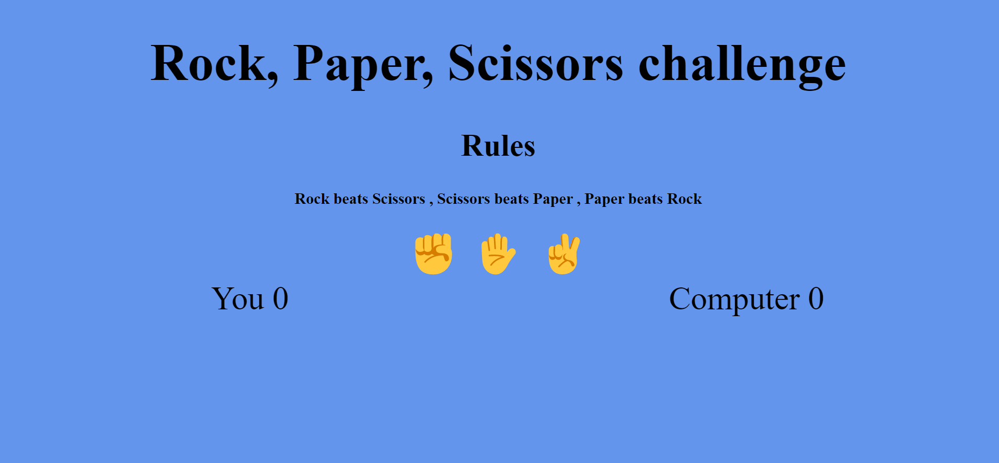

# The way to create a rock, paper, scissors game with Javascript.
The way i created a way for my family and friends gott to have easy accsess to a game that can help them with there future descision makeing.

* [**User Experience**](<#user-experience>)
    * [**Site Structure**](<#site-structure>)
    * [**Colour Scheme**](<#site-structure>)
* [**Features**](<#features>)
    * [**Header**](<#header>)
    * [**Rules**](<#rules>)
    * [**Buttons**](<#buttons>)
    * [**Results**](<#result>)
* [**Technologies Used**](<#technologies-used>)
* [**Testing**](<#testing>)
* [**Deployment**](<#deployment>)
* [**Credits**](<#credits>)
    * [**Content**](<#content>)
*  [**Acknowledgements**](<#acknowledgements>)

## User Experience
* I hade some mutuals to me check out and try the features on their computer and mobile phones to look what i needed to change for it to be responsive.
### Site Structure
* I choose this way to structure the site to be easy to understand and easy for everyone to use and see the scores and learn how the games works.
* The color scheme i have choosen is for it to be a little bit funnier and not so pale but still not to takeing on the eyes.

## Features
### Header
* I choose a normal heading with no special font so that it's easy for everyone to read it the way i choose to name the header so that it explains evverything.
### Rules
* The rules part of the page is made in a way so thats it's easy for every age of people to understand the rules and the way to win and lose.
### Buttons
* The buttons i desgined with emojis insteed of text so you dont have to read or think to much you just choose one of the emojis and that activates the game.
### Results
* On the results i have choosen to add a counter for the computer and the player so that you can see who won and who lost.
* For simplicity and learning reasons i have added a score table below the scores that will show what you choose and the computer so you can se why you lost and why the pc won.

## Technologies used
* Github - For publishing and saveing the work i have done.
* Gitpod - For working on the scripts and codes.
* HTML - For the structure of the site.
* CSS - So that i can change and style all the content and make it responsive.
* Javascript - So that i cna make the game work and make it reactive so that it's possible that the game is playble.
## Testing
* I tried the website on Firefox, Google Chrome and Apples Safari.
    * It worked very good on all the spaces but the button emoji change when you go to a diffrent explorer.
* When i put it through the CSS and HTML testing ground it went good and i got good results.
### Lighthouse test on Google

## Deployment
* I published the site on Github by going in to settings then clicking on pages then changeing the branch to main.
* You can fork the repositery by going in to the main page of the repositery and clicking in the right cornor on the fork button.
* You clone the repositery by going to the main page and to the left of the Gitpod button you will see a button that says code ther you can click and then click on clone.

## Credits
* I got insperation from Code Institute to forfill this project.
* Code Institute teached me how to use the langueses used in this project.

## Media
* All the pichtures are from the creater Hampus Strate.

[Back to top](<#user-experience>)